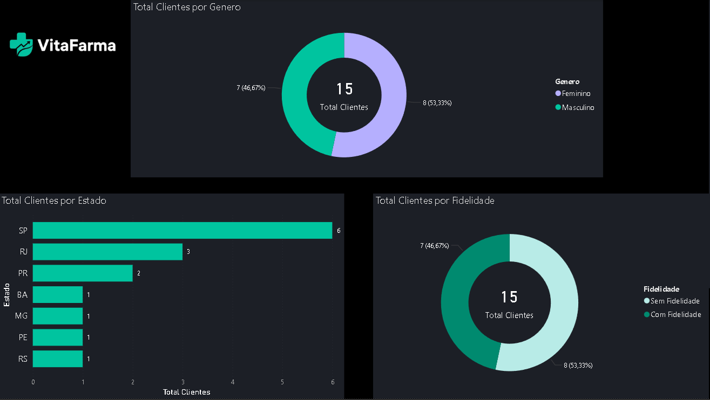

# VitaFarma - SQL e Power BI

Dashboard analítico completo desenvolvido para simular o ambiente de trabalho de um Analista de Dados Júnior. O projeto cobre o ciclo completo de análise: modelagem de dados em SQL, limpeza e validação, queries analíticas e visualização em Power BI.

---

## 📊 Contexto

A **VitaFarma** é uma rede fictícia de farmácias com 10 unidades distribuídas em 5 estados brasileiros (SP, RJ, MG, PR, RS, PE e BA). O dataset cobre o período de **janeiro de 2023 a dezembro de 2024** e simula dados reais de vendas, produtos, clientes e lojas.

---

## 💡 Principais Insights

| Região | Faturamento Total | Destaques |
|---|---|---|
| Sudeste | R$ 93,26 mil | Centro SP lidera com R$ 32 mil |
| Sul | R$ 24,98 mil | Curitiba (R$ 17 mil) supera Porto Alegre em quase R$ 10 mil |
| Nordeste | R$ 16,86 mil | Recife concentra a maior parte da receita regional |

- **Sudeste** registrou pico em junho e queda acentuada em março
- **Sul** teve seu melhor mês em março, com quedas em maio e outubro
- **Nordeste** atingiu mínimo em julho (R$ 1.677) e recuperou progressivamente até novembro (R$ 2.665)
- **Equipamentos de Saúde** é a categoria mais rentável com apenas 3 produtos no mix
- **Plano Fidelidade** com 46% de adesão — oportunidade clara de expansão via CRM
- Dezembro/2024 foi o maior mês de faturamento do período analisado

---

## 🗂️ Estrutura do Projeto

```
vitafarma/
├── vitafarma_dataset.sql       # Script de criação e população do banco
├── vitafarma_theme.json        # Tema dark mode customizado para o Power BI
├── dashboard.pbix              # Dashboard Power BI
├── queries/
│   ├── limpeza.sql             # Auditoria de qualidade dos dados
│   ├── exploracao_inicial.sql  # Primeiras análises exploratórias
│   ├── analise_vendas.sql      # Faturamento e produtos mais vendidos
│   └── dashboard_comercial.sql # Queries que alimentam o dashboard
└── relatorios/
    ├── visao geral.png
    ├── categoria e produto.png
    └── clientes.png
```

---

## 🛠️ Tecnologias

- **SQLite** — modelagem relacional e queries analíticas
- **DB Browser for SQLite** — ambiente de desenvolvimento SQL
- **Power BI Desktop** — visualização e dashboard
- **DAX** — medidas calculadas (Faturamento, Total Clientes, Ticket Médio)

---

## 🗃️ Modelo de Dados

O banco é composto por 6 tabelas com relacionamentos via chave estrangeira:

```
clientes ──┐
           ├──► vendas ──► itens_venda ──► produtos ──► categorias
lojas ─────┘
```

---

## 🔍 Etapas do Projeto

### 1. Limpeza e Qualidade de Dados
Antes de qualquer análise, foi realizada auditoria para garantir a integridade da base:
- Verificação de produtos com custo maior que o preço de venda
- Identificação de vendas sem itens associados via `LEFT JOIN`
- Checagem de clientes duplicados por CPF

### 2. Análise Exploratória em SQL
- Contagem de produtos por categoria
- Filtro de lojas por região
- Segmentação de clientes por plano fidelidade

### 3. Análise de Vendas
- Faturamento total por loja com múltiplos `JOINs`
- Produtos mais vendidos com `HAVING` e agregações
- Evolução mensal do faturamento com `strftime`
- Ticket médio por loja usando subquery

### 4. Dashboard Power BI

**Página 1 — Visão Geral**
- KPI de faturamento total
- Evolução mensal do faturamento (2024)
- Faturamento por loja em barras horizontais
- Filtros por região e período

**Página 2 — Produtos e Categorias**
- Faturamento por categoria em gráfico de rosca
- Top 5 produtos por faturamento com filtro dinâmico Top N

**Página 3 — Clientes**
- Distribuição por gênero
- Distribuição por plano fidelidade
- Total de clientes por estado

---

## 📸 Dashboard

### Visão Geral


### Produtos e Categorias


### Clientes


---

## ▶️ Como Reproduzir

1. Execute o `vitafarma_dataset.sql` no DB Browser for SQLite para criar o banco
2. Importe o `vitafarma_theme.json` no Power BI via **Exibição → Temas → Procurar temas**
3. Conecte o Power BI ao arquivo `.db` via **Obter Dados → ODBC → SQLite**
4. Abra o `dashboard.pbix`
